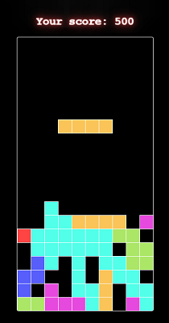
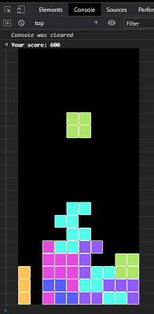

# TetrisJS

A JavaScript Tetris game.

## Features
- Play in the browser.
- Play in the DevTool Console. Run `startConsoleTetris()`

## Controls:
- `Enter` - start/pause/restart game
- `Up arrow` - rotate tetromino
- `Left/Right/Down arrows` - move left/right/down
- `Space` - hard drop

## Demo
[TetrisJS](https://kurgalinn.github.io/tetris-js/)

## Inspirer
[Learning Modern JavaScript with Tetris](https://medium.com/@michael.karen/learning-modern-javascript-with-tetris-92d532bcd057)